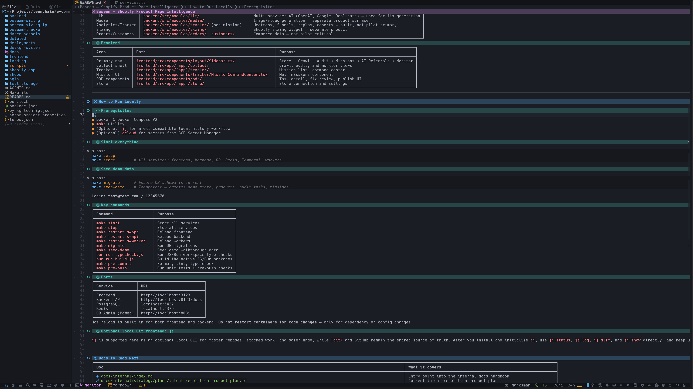

<p align="center">
  
  
  
</p>

# vscode-productivity.nvim

> VS Code-style workflows **for Neovim** — quick open, project search, LSP navigation, terminal management, task running, AI agents, and clickable statusline icons.

[](https://github.com/pankaj4u4m/vscode-productivity.nvim)

**A Neovim plugin** that brings VS Code-style productivity actions to your editor. It detects and dispatches to existing community plugins — it only owns the glue. Works with **[LazyVim](https://github.com/LazyVim/LazyVim)**, **[AstroNvim](https://github.com/AstroNvim/AstroNvim)**, **[NvChad](https://github.com/NvChad/NvChad)**, or your own config from scratch.

> 💡 **Not a VS Code extension.** This is a Neovim plugin that mimics VS Code's workflow patterns — quick open (Ctrl+P), command palette, file explorer, problems panel, integrated terminal, and more.

---

## What's included

| Module | File | Requires |
|---|---|---|
| **Productivity actions** (core) | [`lua/vscode_productivity/init.lua`](./lua/vscode_productivity/init.lua) | Nothing — detects backend plugins at runtime |
| **Usage tracking** | [`lua/vscode_productivity/usage.lua`](./lua/vscode_productivity/usage.lua) | Nothing — bundled with the core |
| **Statusline icons** (optional) | [`lua/vscode_productivity/statusline.lua`](./lua/vscode_productivity/statusline.lua) | [`rebelot/heirline.nvim`](https://github.com/rebelot/heirline.nvim) |
| **Panel persistence** | [`lua/vscode_productivity/persistence.lua`](./lua/vscode_productivity/persistence.lua) | Nothing — built-in, enabled by default |

### Statusline: AstroNvim vs standalone

The statusline module works with **any [Heirline](https://github.com/rebelot/heirline.nvim)-based statusline**. It merges VS Code button icons into whatever statusline you already have.

- **AstroNvim users**: just call `.overrides()` — it automatically preserves [AstroNvim's](https://github.com/AstroNvim/AstroNvim) existing components.
- **Standalone Heirline users**: same API. Pass in your own base statusline.

---

## Features



- **VS Code productivity actions**: quick open, command palette, search in files, search & replace, git, LSP navigation, tasks, etc.
- **AI agent terminal**: pick and launch any CLI agent ([Claude](https://github.com/anthropics/claude-code), [Copilot](https://github.com/features/copilot), [Codex](https://github.com/openai/codex), [Kilo](https://github.com/kilowhiskey), [Aider](https://github.com/paul-gauthier/aider), [Cline](https://github.com/cline/cline), [OpenCode](https://github.com/sst/opencode), [Agy](https://github.com/antigravity/agy))
- **Clickable statusline icons** — optional [Heirline](https://github.com/rebelot/heirline.nvim) module with VS Code-style buttons
- **Usage tracking** — automatically tracks your most-used actions with a frequency-sorted picker
- **Dock help** — discover all registered icons, shortcuts, and commands via a picker
- **Panel persistence** — remembers which panels are open across restarts (like VS Code's window state)
- **All backends are optional** — auto-detects at runtime:

| Backend | Repo |
|---|---|
| Picker | [`folke/snacks.nvim`](https://github.com/folke/snacks.nvim) · [`nvim-telescope/telescope.nvim`](https://github.com/nvim-telescope/telescope.nvim) · [`ibhagwan/fzf-lua`](https://github.com/ibhagwan/fzf-lua) |
| Explorer | [`nvim-neo-tree/neo-tree.nvim`](https://github.com/nvim-neo-tree/neo-tree.nvim) · [`folke/snacks.nvim`](https://github.com/folke/snacks.nvim) |
| Terminal | [`akinsho/toggleterm.nvim`](https://github.com/akinsho/toggleterm.nvim) · [`folke/snacks.nvim`](https://github.com/folke/snacks.nvim) |
| Problems / Quickfix | [`folke/trouble.nvim`](https://github.com/folke/trouble.nvim) |
| Outline | [`stevearc/aerial.nvim`](https://github.com/stevearc/aerial.nvim) · [`folke/trouble.nvim`](https://github.com/folke/trouble.nvim) |
| Tasks | [`stevearc/overseer.nvim`](https://github.com/stevearc/overseer.nvim) |
| Search & Replace | [`MagicDuck/grug-far.nvim`](https://github.com/MagicDuck/grug-far.nvim) |
| Statusline | [`rebelot/heirline.nvim`](https://github.com/rebelot/heirline.nvim) |

---

## Installation

### [lazy.nvim](https://github.com/folke/lazy.nvim) (any framework)

```lua
{
  "pankaj4u4m/vscode-productivity.nvim",
  lazy = false,
  dependencies = {
    -- All optional — only install what you use
    "folke/snacks.nvim",           -- pickers, git status, notifications
    "nvim-neo-tree/neo-tree.nvim", -- file explorer
    "folke/trouble.nvim",          -- problems / quickfix / outline
    "MagicDuck/grug-far.nvim",     -- search and replace
    "stevearc/overseer.nvim",      -- task runner
  },
  opts = {
    integrations = {
      -- explorer = function() ... end,
      -- terminal = function() ... end,
      -- problems = function() ... end,
      -- tasks = function() ... end,
      -- agent_terminal = function() ... end,
    },
  },
  config = function(_, opts)
    require("vscode_productivity").setup(opts)
  end,
}
```

### With statusline icons ([Heirline](https://github.com/rebelot/heirline.nvim) — works with AstroNvim, LazyVim, or standalone)

```lua
{
  "rebelot/heirline.nvim",
  dependencies = { "pankaj4u4m/vscode-productivity.nvim" },
  opts = require("vscode_productivity.statusline").overrides(),
}
```

### Via git submodule (for [dotfiles](https://github.com/pankaj4u4m/dotfiles))

```bash
git submodule add https://github.com/pankaj4u4m/vscode-productivity.nvim \
  .config/nvim/packages/vscode-productivity.nvim
git submodule update --init --recursive
```

```lua
{
  dir = vim.fn.stdpath("config") .. "/packages/vscode-productivity.nvim",
  name = "vscode-productivity.nvim",
  lazy = false,
  dependencies = {
    "folke/snacks.nvim",
    "nvim-neo-tree/neo-tree.nvim",
    "folke/trouble.nvim",
    "MagicDuck/grug-far.nvim",
    "stevearc/overseer.nvim",
  },
  opts = { integrations = { ... } },
  config = function(_, opts)
    require("vscode_productivity").setup(opts)
  end,
}
```

---

## Configuration

### Core plugin (`setup()`)

```lua
require("vscode_productivity").setup({
  -- VS Code-style keymaps (<C-p>, <C-b>, <C-`>, <F2>, <F12>, etc.)
  enable_vscode_keymaps = true,

  -- Custom integration callbacks (override automatic backend detection)
  integrations = {
    explorer = nil,      -- function() … end
    terminal = nil,      -- function() … end
    problems = nil,      -- function() … end
    outline = nil,       -- function() … end
    tasks = nil,         -- function() … end
    agent_terminal = nil, -- function() … end
  },

  -- Usage tracking
  usage = {
    state_file = function()
      return vim.fn.stdpath("state") .. "/vscode-productivity/usage.json"
    end,
  },

  -- Panel state persistence (enabled by default)
  -- Remembers which panels were open and restores them on next start.
  -- Set to false to disable.
  -- See lua/vscode_productivity/persistence.lua for advanced options.
  panel_persistence = true,
})
```

### Statusline (`overrides()`)

```lua
-- Custom icon overrides
require("vscode_productivity.statusline").overrides({
  icons = {
    explorer = "󰙅",
    quick_open = "󰈞",
    terminal = "",
    tasks = "󱂬",
    debug = "",
  },
})

-- Custom button entries (replaces defaults)
require("vscode_productivity.statusline").overrides({
  left_entries = {
    {
      name = "my_tool",
      label = "My Tool",
      icon = "",
      callback = function() print("Hello!") end,
      is_active = function() return false end,
    },
  },
  right_entries = nil, -- nil = keep defaults
})
```

---

## AstroNvim integration example

This plugin works out of the box with [AstroNvim](https://github.com/AstroNvim/AstroNvim). Reference config:

### `lua/plugins/vscode-productivity.lua`

```lua
return {
  {
    dir = vim.fn.stdpath("config") .. "/packages/vscode-productivity.nvim",
    name = "vscode-productivity.nvim",
    lazy = false,
    dependencies = {
      "folke/snacks.nvim",
      "nvim-neo-tree/neo-tree.nvim",
      "folke/trouble.nvim",
      "MagicDuck/grug-far.nvim",
      "stevearc/overseer.nvim",
    },
    opts = {
      integrations = {
        explorer = function()
          require("neo-tree.command").execute({ toggle = true, source = "filesystem", position = "left" })
        end,
        terminal = function()
          _G.toggle_term_edge(1, 25, "horizontal")
        end,
        problems = function()
          if vim.fn.exists(":Trouble") == 2 then
            vim.cmd("Trouble diagnostics toggle")
          else
            vim.diagnostic.setloclist()
            vim.cmd("lopen")
          end
        end,
        tasks = function()
          vim.cmd("OverseerToggle!")
        end,
        agent_terminal = function()
          vim.cmd("VSCodeAgentTerminal")
        end,
      },
    },
    config = function(_, opts)
      require("vscode_productivity").setup(opts)
    end,
  },
}
```

### `lua/plugins/vscode-statusline.lua`

```lua
return {
  "rebelot/heirline.nvim",
  opts = require("vscode_productivity.statusline").overrides(),
  dependencies = { "vscode-productivity.nvim" },
}
```

### `lua/polish.lua` (AstroNvim's post-plugin hook) — minimal

> **Panel state persistence is now built into the plugin (enabled by default).**
> `polish.lua` only needs global UI tweaks and the `_G.toggle_term_edge` alias.

```lua
vim.opt.laststatus = 3
vim.opt.splitkeep = "screen"

-- Global alias so toggleterm edge helper works from commands / keymaps
function _G.toggle_term_edge(...)
  return require("vscode_productivity").toggle_term_edge(...)
end
```

---

## Commands

| Command | Action |
|---|---|
| `:VSCodeQuickOpen` | Quick open files |
| `:VSCodeBuffers` | List open buffers |
| `:VSCodeRecent` | Recent files |
| `:VSCodeProjects` | Project picker |
| `:VSCodeCommandPalette` | Command palette |
| `:VSCodeNotifications` | Notification history |
| `:VSCodeJumps` | Jump history |
| `:VSCodeQuickfix` | Quickfix list |
| `:VSCodeSearch` | Search in files |
| `:VSCodeSearchWord` | Search current word |
| `:VSCodeSearchReplace` | Search and replace |
| `:VSCodeTodo` | TODO comments |
| `:VSCodeGitFileHistory` | Git file history |
| `:VSCodeExplorer` | Toggle explorer |
| `:VSCodeProblems` | Toggle problems |
| `:VSCodeOutline` | Toggle outline |
| `:VSCodeTerminal` | Toggle terminal |
| `:VSCodeTerminalRight` | Toggle right terminal |
| `:VSCodeTasks` | Toggle tasks |
| `:VSCodeRunTask` | Run task |
| `:VSCodeBuildTask` | Run build task |
| `:VSCodeTestTask` | Run test task |
| `:VSCodeTaskAction` | Task action |
| `:VSCodeAgentTerminal` | AI agent terminal |
| `:VSCodeEditHistory` | Edit/undo history |
| `:VSCodeOrganizeImports` | Organize imports |
| `:VSCodeUsage` | Most used actions |
| `:VSCodeDockHelp` | Dock icon help |

## Keymaps

### VS Code-style (optional, enabled via `enable_vscode_keymaps = true`)

| Keys | Action |
|---|---|
| `<C-p>` | Quick open |
| `<C-b>` | Toggle explorer |
| `<C-\`>` | Toggle terminal |
| `<M-Left>` | Jump back |
| `<M-Right>` | Jump forward |
| `<F2>` | Rename symbol |
| `<F12>` | Go to definition |
| `<S-F12>` | Find references |
| `<M-F12>` | Go to implementation |
| `<C-LeftMouse>` | Go to definition |

### Leader keymaps (always active)

| Keys | Action |
|---|---|
| `<leader>ff` | Quick open |
| `<leader>fb` | Buffers |
| `<leader>fr` | Recent files |
| `<leader>fp` | Projects |
| `<leader>sp` | Command palette |
| `<leader>/` | Search in files |
| `<leader>sg` | Search in files |
| `<leader>sr` | Search and replace |
| `<leader>sw` | Search current word |
| `<leader>e` | Explorer |
| `<leader>xx` | Problems |
| `<leader>xo` | Outline |
| `<leader>ss` | Document symbols |
| `<leader>sS` | Workspace symbols |
| `<leader>st` | TODO list |
| `<leader>sj` | Jumps |
| `<leader>sq` | Quickfix |
| `<leader>su` | Edit history |
| `<leader>si` | Dock help |
| `<leader>sA` | Most used actions |
| `<leader>n` | Notifications |
| `<leader>ot` | Tasks |
| `<leader>or` | Run task |
| `<leader>ob` | Build task |
| `<leader>oT` | Test task |
| `<leader>oa` | Task action |
| `<leader>a` | Agent terminal |
| `<leader>ca` | Code action |
| `<leader>co` | Organize imports |
| `<leader>cr` | Rename |
| `<leader>gf` | Git file history |
| `<leader>gt` | Git status |

## API

### `require("vscode_productivity").actions()`

Returns a table of all action functions. Useful for custom keymaps:

```lua
local actions = require("vscode_productivity").actions()
vim.keymap.set("n", "<C-p>", actions.quick_open)
vim.keymap.set("n", "<leader>sr", actions.search_replace)
```

### `require("vscode_productivity").toggle_term_edge(id, size, direction)`

Open a [toggleterm](https://github.com/akinsho/toggleterm.nvim) terminal pinned to the screen edge. Bypasses toggleterm's default `open_split` to avoid piling up terminals.

```lua
-- Right-side terminal (80 cols)
require("vscode_productivity").toggle_term_edge(2, 80, "vertical")
-- Bottom terminal (25 rows)
require("vscode_productivity").toggle_term_edge(1, 25, "horizontal")
```

### `require("vscode_productivity").register_dock_entries(entries)`

Register entries for the dock help picker (`:VSCodeDockHelp` or `<leader>si`). Used internally by the statusline module.

### `require("vscode_productivity.persistence").register_panel(name, spec)`

Register a custom panel for state persistence:

```lua
require("vscode_productivity.persistence").register_panel("my_panel", {
  label = "My Panel",
  filetypes = { "my-ft" },
  check = function()
    for _, win in ipairs(vim.api.nvim_list_wins()) do
      if vim.bo[vim.api.nvim_win_get_buf(win)].filetype == "my-ft" then
        return true
      end
    end
    return false
  end,
  open = function()
    vim.cmd("MyToggleCommand")
  end,
})
```

---

## Backend detection

The plugin detects installed plugins at runtime and dispatches to the first available:

| Feature | Priority |
|---|---|
| **Picker** | [`snacks.nvim`](https://github.com/folke/snacks.nvim) → [`telescope.nvim`](https://github.com/nvim-telescope/telescope.nvim) → [`fzf-lua`](https://github.com/ibhagwan/fzf-lua) |
| **Explorer** | custom callback → [`neo-tree.nvim`](https://github.com/nvim-neo-tree/neo-tree.nvim) → [`snacks.nvim`](https://github.com/folke/snacks.nvim) |
| **Terminal** | custom callback → [`toggleterm.nvim`](https://github.com/akinsho/toggleterm.nvim) → [`snacks.nvim`](https://github.com/folke/snacks.nvim) |
| **Problems** | custom callback → [`trouble.nvim`](https://github.com/folke/trouble.nvim) → location list |
| **Outline** | custom callback → [`aerial.nvim`](https://github.com/stevearc/aerial.nvim) → [`trouble.nvim`](https://github.com/folke/trouble.nvim) |
| **Tasks** | custom callback → [`overseer.nvim`](https://github.com/stevearc/overseer.nvim) |
| **Search/replace** | [`grug-far.nvim`](https://github.com/MagicDuck/grug-far.nvim) |
| **Statusline** | [`Heirline`](https://github.com/rebelot/heirline.nvim) (via optional [`statusline.lua`](./lua/vscode_productivity/statusline.lua)) |

---

## Structure

```
vscode-productivity.nvim/
├── lua/
│   └── vscode_productivity/
│       ├── init.lua          # Core: setup(), actions(), commands, keymaps
│       ├── usage.lua         # Usage tracking and most-used picker
│       ├── statusline.lua    # Heirline statusline icon overrides (optional)
│       └── persistence.lua   # Panel state persistence (save/restore layout)
├── plugin/
│   └── vscode-productivity.lua  # Auto-load: creates commands on startup
├── README.md
└── LICENSE
```

---

## Related

- [AstroNvim](https://github.com/AstroNvim/AstroNvim) — framework used in the integration examples
- [LazyVim](https://github.com/LazyVim/LazyVim) — another popular Neovim framework

## License

MIT — see [`LICENSE`](./LICENSE).
